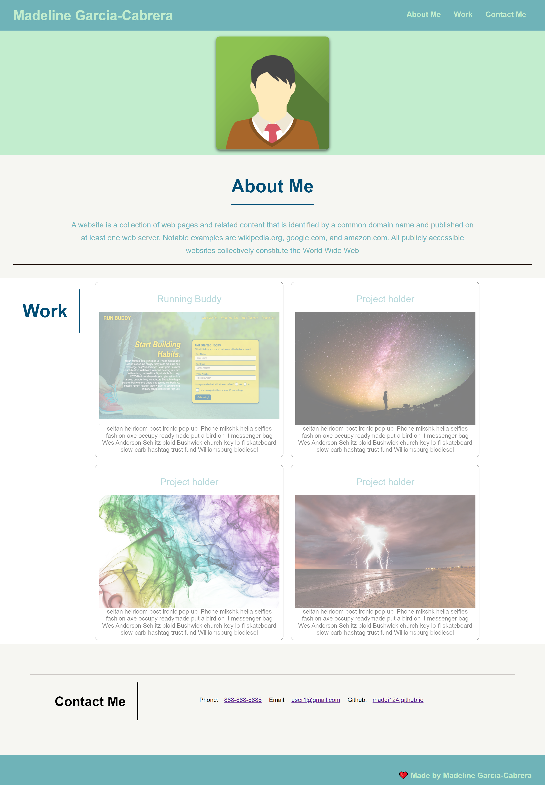
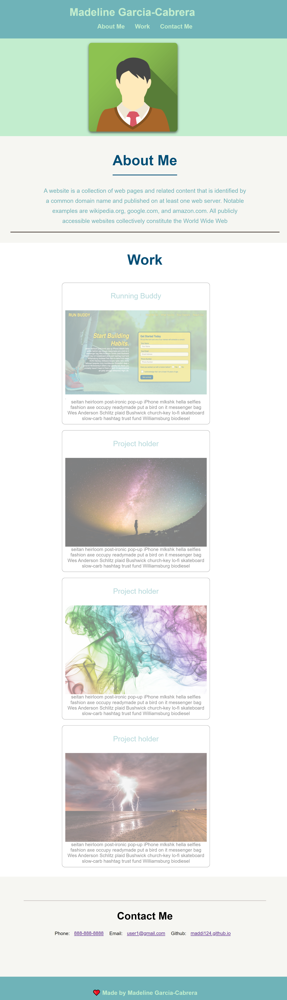
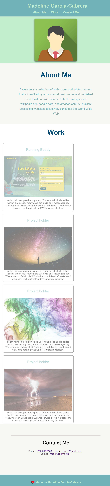
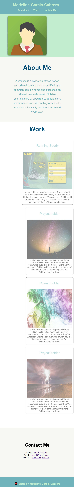

# Portfolio
# Description
For this week's challege, We had to create a web application from scratch. I build a Portfolio page with the skills that I learned recently such as flexbox,Media Queries and CSS variables. <br>
By buliding a Portfolio page it will showcase my skills in web development to future employers.<br> 

# Table of contents
* [website in 980px](#This-is-the-web-page-in-980px)
* [website in 790px](#This-is-the-web-page-in-790px)
* [website in 575px](#This-is-the-web-page-in-575px)
* [User Story](#User-story)
* [Acceptance Criiteria](#Acceptance-Criteria)
* [Credits](#Websites-that-I-used)
 

## This is the web page in normal screen 
``` html
For the work section, I didn't have any work to display, so I placed a placeholder as the title and a ramdom picture I find in google. As the first card I used the Running Buddy that I worked on for class work. I added a <a href=" "> on each card, but only the Running Buddy card should take you to website. While the others have <a href="#"> <br>
As the screen changes in px the items should center along with the changes.
```

 

A problem that I encounter during coding was with Media Queries. I didn't understand
why my code that I added in Media Queries was not being display. I had to look back on previous project to see what I was missing. I forgot to add <br> meta name="viewport" content="width=device-width, initial-scale=1.0" in the head section. 

``` html
 <meta name="viewport" content="width=device-width, initial-scale=1.0" />
 ```
## This is the web page in 980px

## This is the web page in 790px

## This is the web page in 575px



# User Story
``` html 
AS AN employer
I WANT to view a potential employee's deployed portfolio of work samples
SO THAT I can review samples of their work and assess whether they're a 
good candidate for an open position
```

# Acceptance Criteria
``` html
GIVEN I need to sample a potential employee's previous work
WHEN I load their portfolio
THEN I am presented with the developer's name, a recent photo or avatar, and links to sections about them, their work, and how to contact them
WHEN I click one of the links in the navigation
THEN the UI scrolls to the corresponding section
WHEN I click on the link to the section about their work
THEN the UI scrolls to a section with titled images of the developer's applications
WHEN I am presented with the developer's first application
THEN that application's image should be larger in size than the others
WHEN I click on the images of the applications
THEN I am taken to that deployed application
WHEN I resize the page or view the site on various screens and devices
THEN I am presented with a responsive layout that adapts to my viewport
```
# Websites that I used
* [w3schools.com](https://www.w3schools.com/css/css3_mediaqueries_ex.asp)<br>
* [web.dev](https://web.dev/responsive-web-design-basics/)